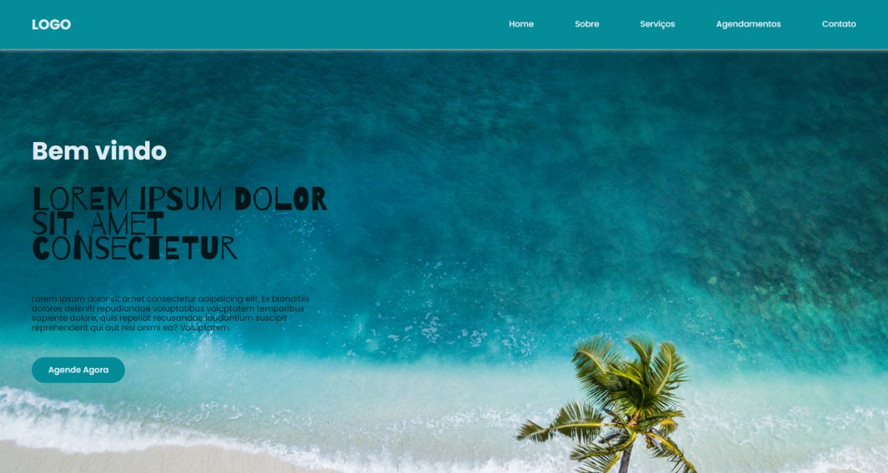

# landing_page_trip

Landing page responsiva - Trip

## 🛠 Habilidades

## Tech Stack :computer:

 
<table>
<tbody>

</tr>

<td align="center" width="20%">
<b>
Flutter
</b> 
 
</td>

<td align="center" width="20%">
<b>
HTML
</b> 
 
</td>

<td align="center" width="20%">
<b>
HTML
</b> 
 
</td>
</tr>

<td align="center" width="20%">
<b>
JavaScript
</b> 
 
</td>
</tr>

</tbody>
</table>

____

### [Clique aqui](https://landing-page-trip.netlify.app/) para acessar a página online!

